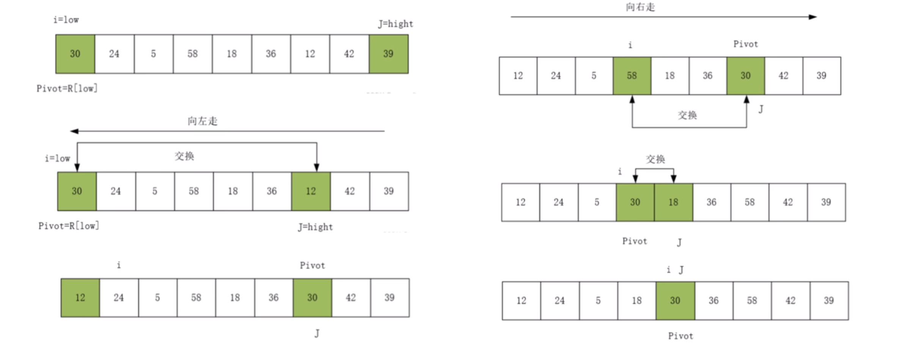

## 排序
| 排序算法 | 平均时间复杂度 | 最坏时间复杂度 | 最优时间复杂度 | 空间复杂度 | 是否稳定 | 适用场景 |
|----------|--------------|--------------|--------------|----------|---------|---------|
| **冒泡排序** (Bubble Sort) | O(n²) | O(n²) | O(n) | O(1) |  是 | 数据规模较小，或已接近有序 |
| **选择排序** (Selection Sort) | O(n²) | O(n²) | O(n²) | O(1) |  否 | 适用于不关心稳定性，交换次数较少的场景 |
| **插入排序** (Insertion Sort) | O(n²) | O(n²) | O(n) | O(1) |  是 | 数据量小，或者数据部分有序 |
| **归并排序** (Merge Sort) | O(n log n) | O(n log n) | O(n log n) | O(n) |  是 | 适用于大规模数据，稳定排序要求高 |
| **快速排序** (Quick Sort) | O(n log n) | O(n²) | O(n log n) | O(log n) |  否 | 适用于一般情况下的数据排序 |
| **堆排序** (Heap Sort) | O(n log n) | O(n log n) | O(n log n) | O(1) |  否 | 适用于数据量大，但不要求稳定性的情况 |
| **计数排序** (Counting Sort) | O(n + k) | O(n + k) | O(n + k) | O(k) |  是 | 适用于数据范围较小的整数排序 |
| **桶排序** (Bucket Sort) | O(n + k) | O(n²) | O(n) | O(n) |  是 | 适用于数据分布均匀的浮点数或整数 |
| **基数排序** (Radix Sort) | O(nk) | O(nk) | O(nk) | O(n + k) |  是 | 适用于定长整数或字符串的排序 |

### 1.冒泡排序
从数组最左端开始向右遍历，依次比较相邻元素大小，如果“左>右”就交换，遍历完成后最大的元素会被移动到最右端<br>
若某轮冒泡中没有执行任何交换操作，说明已经完成排序可以直接返回。<br>
```C++
void BubbleSort(int* arr,int n)//数组arr，长度n
{
	for(int i=0;i<n;i++)
	{
		bool flag=false;//判断是否交换
		for(int j=0;j<n-i-1;j++)
		{
			if(arr[j]>arr[j+1])
			{
				int temp=arr[j];
				arr[j]=arr[j+1];
				arr[j+1]=temp;
				flag=true;
			}//相邻元素比大小并交换
		}
		if(flag)
		{
			break;//若某次不交换，则已有序
		}
	}
}
```
### 2.选择排序
每轮从未排序部分选择最小的元素，放到当前排序位置，直到所有元素排序完成
```C++
void selectionSort(int* arr,int n) 
{
    for (int i = 0; i < n - 1; i++) 
	{
        int minIdx = i;//最小值位置
        for (int j = i + 1; j < n; j++) {
            if (arr[j] < arr[minIdx]) {
                minIdx = j;
            }
        }
        int temp = arr[i];
        arr[i] = arr[minIdx];
        arr[minIdx] = temp;
    }
}
```
### 3.插入排序
逐个取元素插入到已排序部分的正确位置，相当于打牌时整理手牌的过程
```C++
void insertionSort(int* arr, int n) 
{
    int key, j;
    for (int i = 1; i < n; i++) //小于i部分有序
	{
        key = arr[i];//当前要排序元素
        j = i - 1;
        while (j >= 0 && arr[j] > key) 
		{
            arr[j + 1] = arr[j];
            j--;
        }//在已排序部分从右向左查找合适的位置，找到比 key 大的元素并右移
        arr[j + 1] = key;
    }
}
```
### 4.归并排序
递归地将数组拆分为两部分，分别排序后再合并，利用分治思想
```C++
void merge(int* arr, int left, int mid, int right) {
    int n1 = mid - left + 1, n2 = right - mid;
    int L[n1], R[n2];
    for (int i = 0; i < n1; i++) 
	{
		L[i] = arr[left + i];
	}
    for (int i = 0; j < n2; i++) 
	{
		R[i] = arr[mid + 1 + i];
	}//左右两个新数组
    int i = 0, j = 0, k = left;
    while (i < n1 && j < n2) 
	{
		arr[k++] = (L[i] <= R[j]) ? L[i++] : R[j++];
	}//合并 L[] 和 R[] 回 arr[left...right]
    while (i < n1) 
	{
		arr[k++] = L[i++];
	}
    while (j < n2) 
	{
		arr[k++] = R[j++];
	}//复制剩余元素
}

void mergeSort(int arr[], int left, int right) {
    if (left < right) {
        int mid = left + (right - left) / 2;
        mergeSort(arr, left, mid);
        mergeSort(arr, mid + 1, right);
        merge(arr, left, mid, right);
    }
}
```

### 5.快速排序
选取一个基准元素（pivot），将小于它的放左边，大于它的放右边，然后递归排序左右两部分

```C++
int partition(int* arr, int low, int high) {
    int pivot = arr[high];//基准值默认为最右侧的值
    int i = low - 1；//i 指向小于 pivot 的区域的最后一个位置
	int temp;
    for (int j = low; j < high; j++) {
        if (arr[j] < pivot) {
            i++;//扩大小于pivot的区域
            temp = arr[i];
            arr[i] = arr[j];
            arr[j] = temp;
        }
    }
    temp = arr[i + 1];
    arr[i + 1] = arr[high];
    arr[high] = temp;//pivot归位
    return i + 1;//返回pivot位置
}

void quickSort(int arr[], int low, int high) {
    if (low < high) {
        int pi = partition(arr, low, high);
        quickSort(arr, low, pi - 1);
        quickSort(arr, pi + 1, high);
    }
}
```
### 6.桶排序
将元素按范围划分到不同的桶中，每个桶内部排序，最后合并桶中的元素(需要algorithm)
```C++
void bucketSort(float* arr, int n) {
    const int bucketSize = 10;  // 桶的数量
    float buckets[bucketSize][n];  // 桶数组，每个桶最多存储 n 个元素
    int bucketCount[bucketSize] = {0};  // 记录每个桶的元素个数
    // 1. 将数据分配到桶中
    for (int i = 0; i < n; i++) 
	{
        int bi = bucketSize * arr[i];  // 计算桶的索引（假设数据在 [0,1) 之间）
        buckets[bi][bucketCount[bi]++] = arr[i];  // 放入桶中
    }
    // 2. 对每个桶进行排序
    for (int i = 0; i < bucketSize; i++) 
	{
        std::sort(buckets[i], buckets[i] + bucketCount[i]); 
    }
    // 3. 将排序后的桶合并回原数组
    int index = 0;
    for (int i = 0; i < bucketSize; i++) 
	{
        for (int j = 0; j < bucketCount[i]; j++)
		{
            arr[index++] = buckets[i][j];  // 按顺序收集桶内元素
        }
    }
}
```