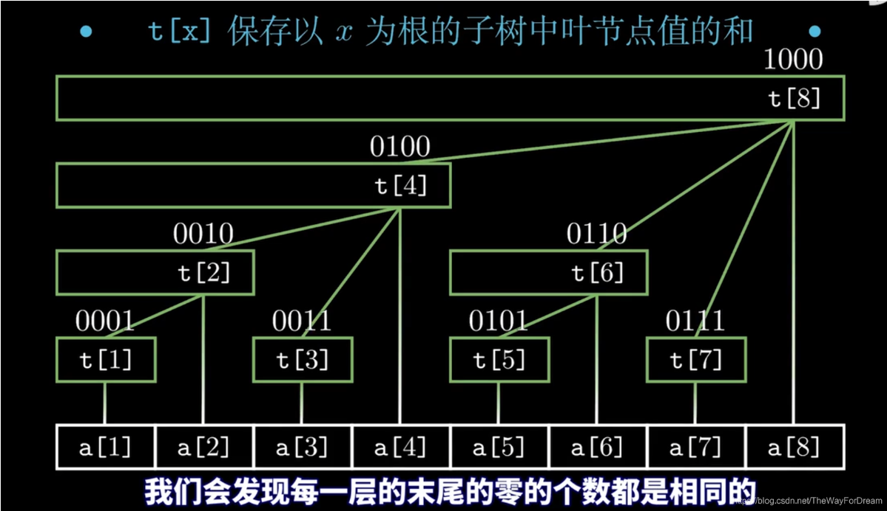

# 经典算法模板
## 1.深度优先搜索DFS
从根节点开始，尽可能深的搜索每一个分治，把每一个分支走到尽头后回溯到上一个结点，继续深搜<br>
注：深搜会穷举所有路径，为暴力搜索，时间复杂度较高<br>
代码模板：<br>
```C++
#include<iostream>
using namespace std;

bool check()
{

}
void dfs()
{
	if(满足边界条件)
	{
		return;
	}
	for(int i=0;i<路径数量;i++)
	{
		if(check)
		{
			修改现场;
			dfs();
			还原现场;
		}
	}
}
```
### 1.（1）例题：给定二叉搜索树的根节点root，返回值位于范围[low,high]之间的所有结点的值的和(根节点的值大于左子树，小于右子树)
<br>
<br>
```C++
/*struct TreeNode
{
	int val;
	TreeNode* left;
	TreeNode* right;
};*/

int rangesum(TreeNode* root, int low, int high)
{
	if (root == nullptr)
	{
		return 0;
		//递归边界，死胡同
	}
	if (root->val > high)
	{
		return rangesum(root->left, low, high);
		//如果树值大于high则只需搜索左侧
	}
	if (root->val < low)
	{
		return rangesum(root->right, low, high);
		//如果树值小于low则只需搜索右侧
	}
	return (root->val) + rangesum(root->left, low, high) + rangesum(root->right, low, high);
	//否则返回自己的val并继续搜索左右树
}
```
### 1.（2）例题：<br>
<br>
```C++
#include<iostream>
#include<cstdlib>
using namespace std;

void dfs(int** map, int row, int col, int x, int y)
{
	if (x < 0 || x >= row || y < 0 || y >= col || map[x][y] == 0)
	{
		return;//边界条件
	}
	map[x][y] = 0;//标记
	dfs(map, row, col, x + 1, y);
	dfs(map, row, col, x - 1, y);
	dfs(map, row, col, x, y + 1);
	dfs(map, row, col, x, y - 1);//继续搜索边界
}

int islandnum(int** map, int row, int col)
{
	if (map == nullptr || row == 0)
	{
		return 0;
	}
	int count = 0;
	for (int i = 0; i < row; i++)
	{
		for (int j = 0; j < col; j++)
		{
			if (map[i][j] == 1)
			{
				count++;
				dfs(map, row, col, i, j);
				//利用深搜将与此1连接的1全部标记为0
			}
		}
	}
	return count;
}

int main()
{
	cout << "输入r行c列:";
	int r, c;
	cin >> r >> c;
	cout << "输入地图：" << endl;
	int** map = new int* [r+1];
	for (int i = 0; i < r; i++)
	{
		map[i] = new int[c+1];
	}
	for (int i = 0; i < r; i++)
	{
		for (int j = 0; j < c; j++)
		{
			cin >> map[i][j];
		}
	}
	int ans = islandnum(map, r, c); // 计算岛屿数量
	cout << "岛屿数量为：" << ans;
	for (int i = 0; i < r; i++)
	{
		delete[] map[i];
	}
	delete[] map;
	return 0;
}
```
### 1.（3）回溯算法（经典N皇后问题）
采用试错的思想，它尝试分步的去解决一个问题。在分步解决问题的过程中，当它通过尝试发现现有的分步答案不能得到有效的正确的解答的时候，它将取消上一步甚至是上几步的计算，再通过其它的可能的分步解答再次尝试寻找问题的答案。<br>

N皇后例题：<br>
思路：<br>
(1)存储方式：二维字符串vetor数组，每一个字符串表示一个解法中的一行，每个一维数组表示一种解法，所有解法存在二维数组中。<br>
(2)标记方式：二维字符数组queen，Q表示皇后.表示空；二维bool数组attack,1表示会被攻击0表示不会<br>
<br>
放置Q后，有八个方向需要被标记，构建向量数组，循环时利用这八个向量对attack进行标记<br>
<br>
(3)回溯法寻找结果：从第0行开始每行放置Q并标记attack，当某一行无可放位置时说明上一个Q放置不正确，需回溯并重新选择位置。<br>
<br>
代码示例：
```C++
#include <iostream>
#include<vector>
#include<string>
using namespace std;

const int dx[]={0,1,1,1,0,-1,-1,-1};
const int dy[]={1,1,0,-1,-1,-1,0,1};//方向向量，从正下开始逆时针遍历

void PutQueen(vector<vector<int>>& attack,int x,int y)
{
    attack[y][x]=1;
    for(int i=1;i<attack.size();i++)
    {
        for(int j=0;j<8;j++)//沿8个方向向外扩张
        {
            int x0=x+i*dx[j];
            int y0=y+i*dy[j];
            if(x0<attack.size() && x0>=0 && y0<attack.size() && y0>=0)//在棋盘内
            {
                attack[y0][x0]=1;//标记
            }
        }
    }
}

void Backtrack(int n,int row,vector<string>& queen,vector<vector<int>>& attack,vector<vector<string>>& solve)
{
    //row为当前处理的行
    if(row==n)//此时为合理情况，将此时情况加入解集并返回
    {
        solve.push_back(queen);
        return;
    }
    for(int i=0;i<n;i++)
    {
        if(!attack[row][i])
        {
            vector<vector<int>> temp=attack;//暂存该情况下attack，回溯回来之后用于还原
            queen[row][i]='Q';
            PutQueen(attack,i,row);
            Backtrack(n,row+1,queen,attack,solve);
            attack=temp;
            queen[row][i]='.';//还原
        }
    }
}

vector<vector<string>> SolveNQueens (int n)
{
    vector<vector<string>> solves;
    vector<vector<int>> attack(n);
    vector<string> queen;
    for(int i=0;i<n;i++)
    {
        for(int j=0;j<n;j++)
        {
            attack[i].push_back(0);
        }
        //初始化attack
        queen.push_back("");//加入空字符串
        queen[i].append(n,'.');//初始化该字符串
        //初始化queen
    }
    Backtrack(n,0,queen,attack,solves);//开始从第0行回溯
    return solves;
}

int main()
{
    int n;//n皇后
    cin>>n;
    vector<vector<string>> Solves;
    Solves=SolveNQueens(n);
    cout<<"共"<<Solves.size()<<"种解法："<<endl<<endl;
    for(int i=0;i<Solves.size();i++)
    {
        cout<<"解法"<<i+1<<":"<<endl;
        for(int j=0;j<n;j++)
        {
            cout<<Solves[i][j]<<endl;
        }
    }
    return 0;
}
```
#### 复杂度优化
对于attack[][]这一二维数组，采用一维数组来标记列、主对角线、副对角线的攻击状态，避免大量循环（col大小为n，diag1，diag2大小为2n-1）
- col[j] 记录当前列 j 是否有皇后
- diag1[i - j + n - 1] 记录左上到右下对角线（同一主对角线上的元素行号-列号相同，由于数组索引不为负，平移n-1）
- diag2[i + j] 记录右上到左下对角线（同一副对角线上的元素行号+列号相同）

因此PutQUeen环节的代码可以改为如下
```C++
void PutQueen(vector<int>& col,vector<int>& diag1,vector<int>& diag2,int x,int y)
{
    //put第y行第x列
	col[x]=1;
	diag1[y-x+n-1]=1;
	diag2[y+x]=1;
}
```
回溯时判断是否安全的代码则改为
```C++
if(!col[x] && !diag1[y-x+n-1]=1 && !diag2[y+x]=1)
{
	操作...
}
```

## 2.广度优先搜索BFS
1当碰到岔路口时，总是先一次访问从该岔道口能直接到达的所有结点<br>
2.然后再按这些结点被访问的顺序去依次访问他们能直接到达的结点<br>

代码模板：
```C++
#include<iostream>
#include<queue>
using namespace std;

void bfs()
{
	queue<int> q;
	q.push(起点S);
	标记初始状态已入队
	while(!q.empty())
	{
		int top=q.front();
		q.pop();//队首出队
		for(所有可列举状态)
		{
			if(check)//数据合法
			{
				q.push(temp);//入队
				//标记为已入队
			}
		}
	}
}
```
### 2.（1）例题：

```C++
#include<iostream>
#include<queue>
using namespace std;

char maze[100][100];
bool inq[100][100];//记录入队情况
int r;
int c;
int x[4] = { -1,1,0,0 };
int y[4] = { 0,0,-1,1 };//x[i]y[i]分别为向上下左右

struct node
{
	int x, y;
	int step;
}s,t,node;//起点，终点，临时结点

bool test(int x, int y)
{
	if (x<0 || x>r || y<0 || y>c)//出界
	{
		return false;
	}
	if (maze[x][y] == '*')//墙
	{
		return false;
	}
	if (inq[x][y] == true)//在队里，即走过了
	{
		return false;
	}
	return true;
}

int bfs()
{
	queue<struct node>	q;
	q.push(s);//初始位置入队
	while (!q.empty())
	{
		struct node top = q.front();
		q.pop();//出队
		if (top.x == t.x && top.y == t.y)
		{
			return top.step;//此时为最少步
		}
		for (int i = 0; i < 4; i++)//上下左右
		{
			int newx = top.x + x[i];
			int newy = top.y + y[i];
			if (test(newx, newy))
			//如果下个结点合法就将其入队，继续while
			{
				node.x = newx;
				node.y = newy;
				node.step = top.step + 1;
				q.push(node);
				inq[newx][newy] = true;//标记入队
			}
		}
	}
	return -1;//无解
}

int main()
{
	cout << "输入行和列：";
	cin >> r >> c;
	cout << "输入迷宫：" << endl;
	for (int i = 0; i < r; i++)
	{
		getchar();//吸收换行符
		for (int j = 0; j < c; j++)
		{
			maze[i][j] = getchar();
			if (maze[i][j] == 'S')
			{
				s.x = i;
				s.y = j;
				s.step = 0;
			}
			if (maze[i][j] == 'T')
			{
				t.x = i;
				t.y = j;
				t.step = 0;
			}
		}
	}
	int ans = bfs();
	cout << "最小步数为：" << ans << endl;
	return 0;
}
```

## 3.动态规划
动态规划是一种用于最优化问题的算法设计方法，适用于具有重叠子问题和最优子结构性质的问题。它通过将问题分解为子问题，并存储子问题的解，避免重复计算，从而提高效率
| 方法 | 时间复杂度 | 空间复杂度 | 是否属于动态规划 |
|------|----------|----------|----------------|
| **普通递归** | `O(2ⁿ)` | `O(n)` | **不属于** |
| **递归 + 备忘录** | `O(n)` | `O(n)` | **属于** |
| **自底向上 DP** | `O(n)` | `O(n)` |  **属于** |
| **空间优化 DP** | `O(n)` | `O(1)` |  **属于** |

### 3.（1）斐波那契数列
#### 递归+备忘录
```C++
int fibMemo(int n, vector<int>& memo) {
    if (n <= 1) 
	{
		return n;
	}
    if (memo[n] != -1) 
	{
		return memo[n];  // 查找备忘录
	}
    memo[n] = fibMemo(n - 1, memo) + fibMemo(n - 2, memo);
    return memo[n];
}

int fib(int n) {
    vector<int> memo(n + 1, -1);  // 备忘录的值初始化为-1
    return fibMemo(n, memo);
}
```
#### 自底向上
```C++
int fibDP(int n) {
    if (n <= 1) 
	{
		return n;
	}
    vector<int> dp(n + 1);
    dp[0] = 0;
    dp[1] = 1;
    for (int i = 2; i <= n; ++i) 
	{
        dp[i] = dp[i - 1] + dp[i - 2];
    }
    return dp[n];
}
```
#### 空间优化(滚动数组，优化了自底而上的空间占用问题)
```C++
int fibOptimized(int n) {
    if (n <= 1) return n;
    
    int prev2 = 0, prev1 = 1, curr;
    for (int i = 2; i <= n; ++i) {
        curr = prev1 + prev2;
        prev2 = prev1;
        prev1 = curr;
    }
    
    return curr;
}
```
### 3.(2)利用动态规划解决最长上升子序列问题（LIS）
- 对整个数组v[i]构造出另一个数组，即dp[i]来表示以i结尾的子序列的最大上升子序列的长度
- 选择dp[i]中的最大值作为答案
```C++
#include<iostream>
#include<vector>
using namespace std;

int main()
{
    int num;
    vector<int> v;
    while(cin>>num)
    {
        v.push_back(num);
        if(getchar()=='\n')
        {
            break;
        }
    }
    int n= v.size();
    vector<int> dpMaxLength(n,1);//最长上升子序列长度至少为1（自身
    int ans=0;//答案为dpMaxLength中的最大值
    for(int i =0;i<n;i++)
    {
        for(int j=0;j<i;j++)
        {
            if(v[j]<v[i]) //如果在j位置有比i更小的
            {
                dpMaxLength[i]=max(dpMaxLength[i],dpMaxLength[j]+1);//存在一个可能最大值，即该位置j的最大长度+1，选择更大的
            }
        }
        ans=max(ans,dpMaxLength[i]);
    }
    cout<<ans<<endl;
    return 0;
}
```
该算法复杂度最差为$n^2$，
## 4.滑动窗思想（双指针）
该思想的基本思路是维护一个窗口（通常是一个区间），通过移动窗口的起始位置和结束位置，来遍历整个数组/字符串，并在过程中执行特定的操作。通过不断调整窗口的大小和位置，可以找到满足问题要求的解。<br>
### 4.（1）例题
<br>
思路图例：<br>
<br>

```C++
#include <iostream>
#include<set>
using namespace std;

int main() {
    string str;
    cin>>str;//输入待测字符串
    int left=0;
    int right=0;//窗口首尾位置
    int l=str.length();
    set<char> s;//存储字串中含有的元素
    int sublen=0;
    int max=0;
    while(right<l)
    {
        auto it=s.find(str[right]);
        if(it == s.end())//字串中无当前字符
        {
            s.insert(str[right]);
            right++;
        }
        else
        {
            s.erase(str[left]);
            left++;
        }
        sublen=right-left;
        if(sublen>max)
        {
            max=sublen;
        }
    }
    cout<<max<<endl;
    return 0;
}
```
## 5.树状数组
[文章引用](https://blog.csdn.net/TheWayForDream/article/details/118436732)<br>
树状数组用了二进制的性质，把区间划分成若干个长度为 2 的幂的区间，并将其信息维护在数组中，这里维护的信息以叶节点的值的和为例，比如t[4]=a[1]+a[2]+a[3]+a[4],如图所示

### lowbit
lowbit函数可以得到某个二进制数字最低位的1和后面的0构成的数字，例如lowbit(10110)=10=2
- 计算方法：lowbit(x)=x&(-x)

例：
```
x=010110
-x=101001+1=101011
x&(-x)=10
```
### 单点修改
例如我们对a[1]+k，那么祖先节点t[1],t[2],t[4],t[8]都需要+k更新
```C++
int add(int x,int k)
{
	for(int i=x;i<=n;i+=lowbit(i))
	t[i]+=k;
}
```
在循环中，lowbit分别为1，10，100，i的值分别为1，1+1=10，10+10=100，100+100=1000<br>
修改复杂度为logn
### 区间查询
例如查询前7项的区间和sum[7]=t[4]+t[6]+t[7]
```C++
int query(x){
	int sum = 0;
	for(int i=x;i;i-=lowbit(i)){
		sum+=t[i];
	}
	return sum;
}
```
在循环中，lowbit分别为1，10，i的值分别为111，111-1=110，110-10=100<br>
查询复杂度也为logn