# ACM笔记
## 一.STL
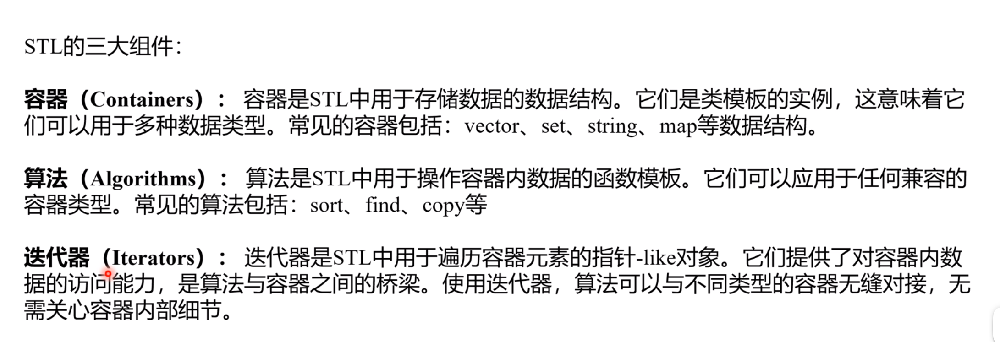
### 1.vector可变长数组，防止越界，节省空间<br>
使用迭代器iterator对vector数组进行访问：<br>
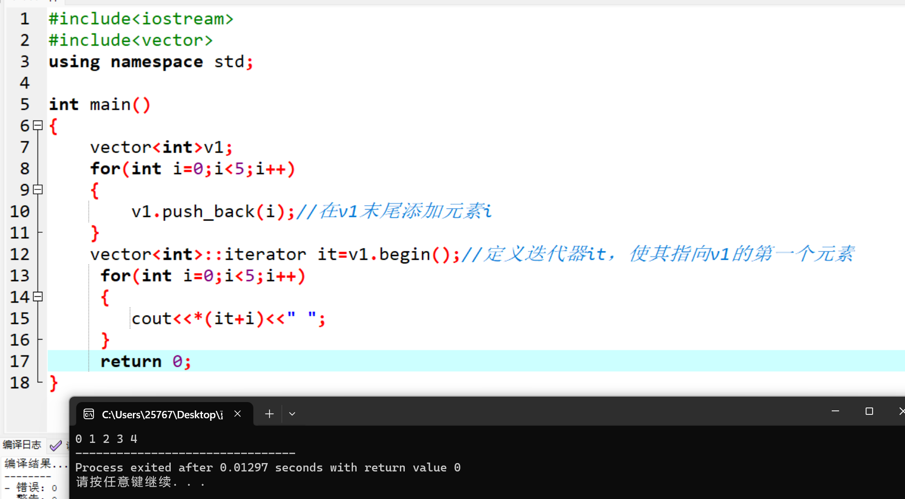<br>
vector常用函数：<br>
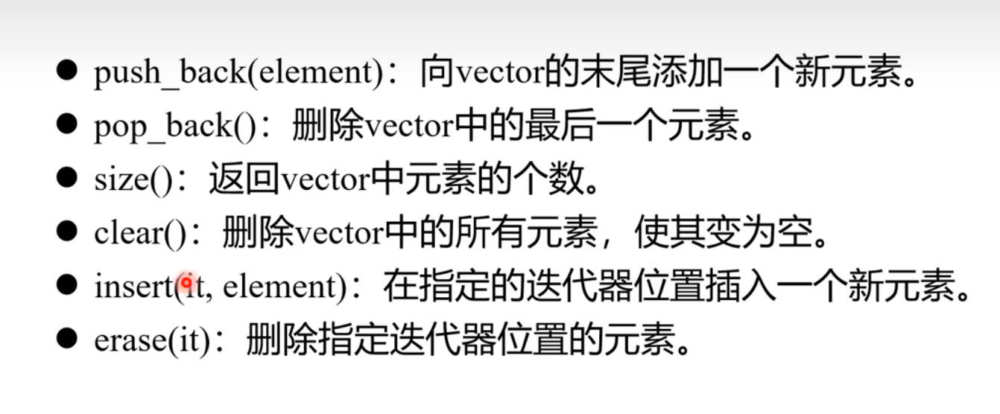<br>
### 2.set自动去重，自动排序<br>
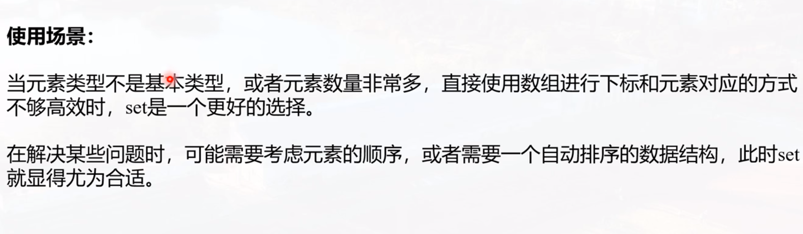<br>
set常用函数：<br>
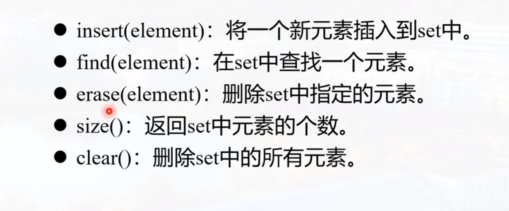<br>
注： set不能通过数组下标访问，只能使用迭代器<br>
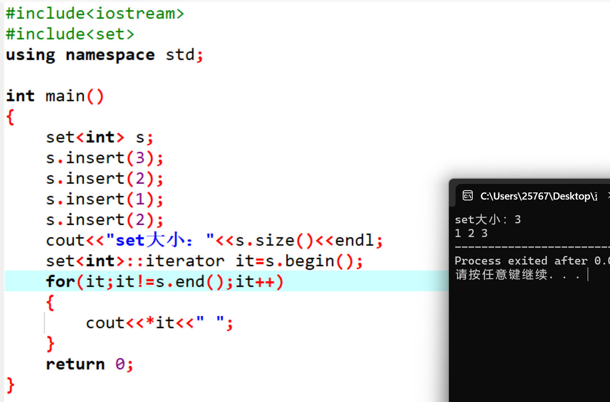<br>
通过find寻找元素5是否存在：<br>
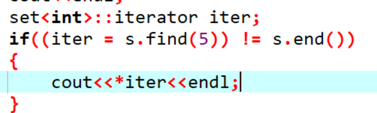<br>
### 3.String字符串，可直接访问也可同char*
字符串拼接的两种方式<br>
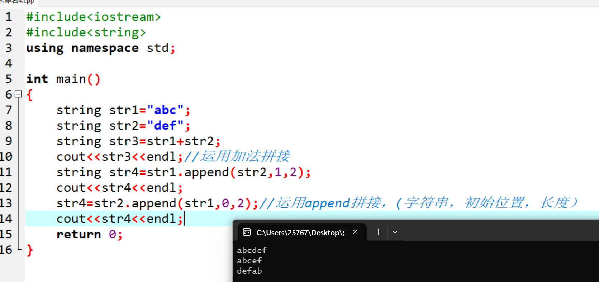<br>
两个string可通过字典序比大小，a<b<br>
s1.compare(s2)，s1大于s2返回1，小于-1，等于0<br>
.length/size()获取字符串长度<br>
.find()查找，.substr()子串:<br>
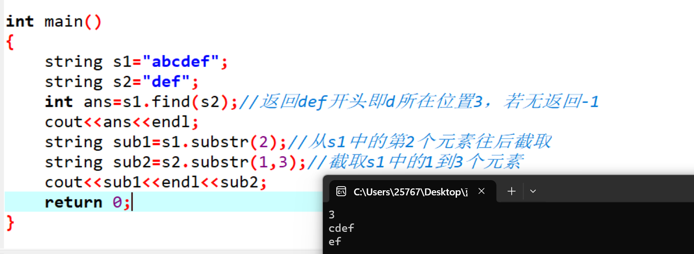<br>
例题：将string类型的数字加法并以string类型输出
```C++
#include<iostream>
#include<string>
using namespace std;

string add(string s1, string s2)
{
	int carry = 0;//判断进位
	while (s1.size() < s2.size())
	{
		s1 = '0' + s1;
	}
	while (s1.size() > s2.size())
	{
		s2 = '0' + s2;
	}//将s1,s2补为相同位数
	string ans = s1;
	for (int i = s1.size() - 1; i >= 0; i--)
	{
		ans[i] = ((s1[i] - '0') + (s2[i] - '0')) % 10 + carry + '0';
		carry = ((s1[i] - '0') + (s2[i] - '0')) / 10;
	}
	if (carry > 0)
	{
		ans = '1' + ans;//最后进位
	}
	return ans;
}

int main()
{
	string a, b;
	cin >> a;
	cout << '+';
	cin >> b;
	string ans = add(a, b);
	cout << '=' << ans;
	return 0;
}
```

## 二.排序
### 1.冒泡排序
从数组最左端开始向右遍历，依次比较相邻元素大小，如果“左>右”就交换，遍历完成后最大的元素会被移动到最右端；<br>
若某轮冒泡中没有执行任何交换操作，说明已经完成排序可以直接返回。<br>
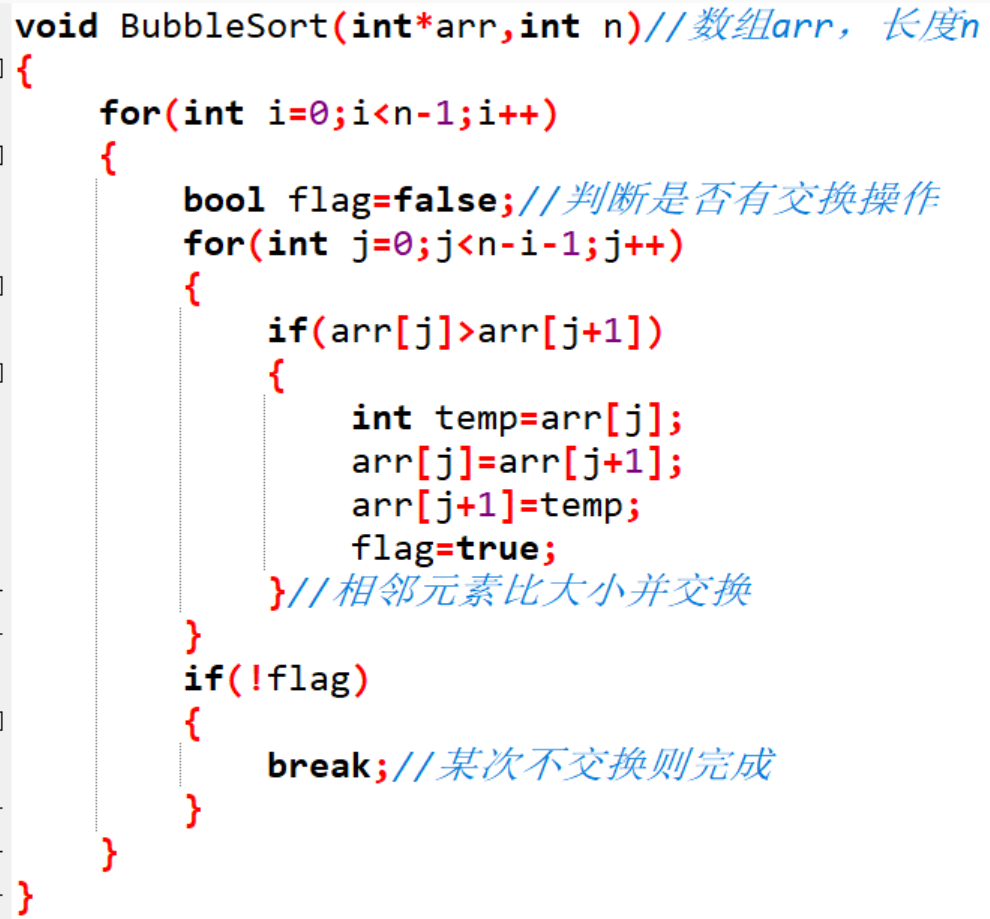
### 2.选择排序
从数组最左端遍历，每次找出最大值和最小值分别放在最左和最右，再在未排序的区域重复操作<br>
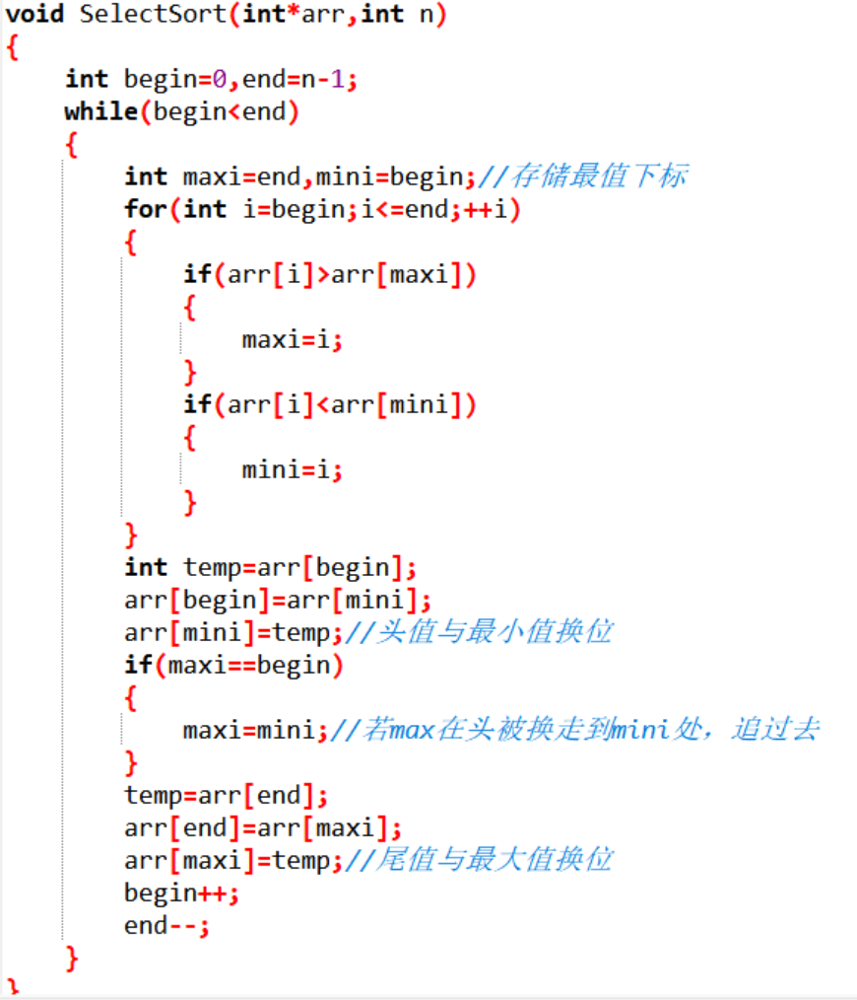<br>
### 3.插入排序
1.从第一个元素开始，将其视为已排序<br>
2.取下一个元素，向前（已排序）扫描，小于则再向前，直至找到合适位置并插入<br>
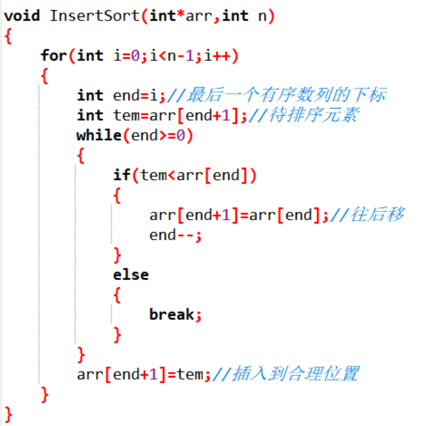<br>
## 三.分治，二分
### 1.分治
1.分解：将原问题分解为若干规模较小，相互独立，与原问题相同的子问题<br>
2.解决：若干子问题容易解决则解决，否则继续分解<br>
3.合并：将小问题的解逐步合并为原问题的解<br>
下面是一个抽象的代码示例（<br>
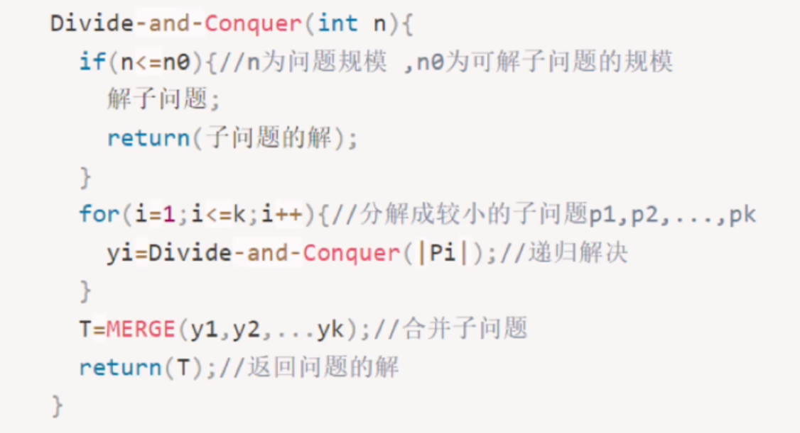<br>
### 2.二分
#### 二分查找
利用数据的有序性，每轮减少一般的搜索范围，直到找到目标元素活搜索区间为空为止<br>
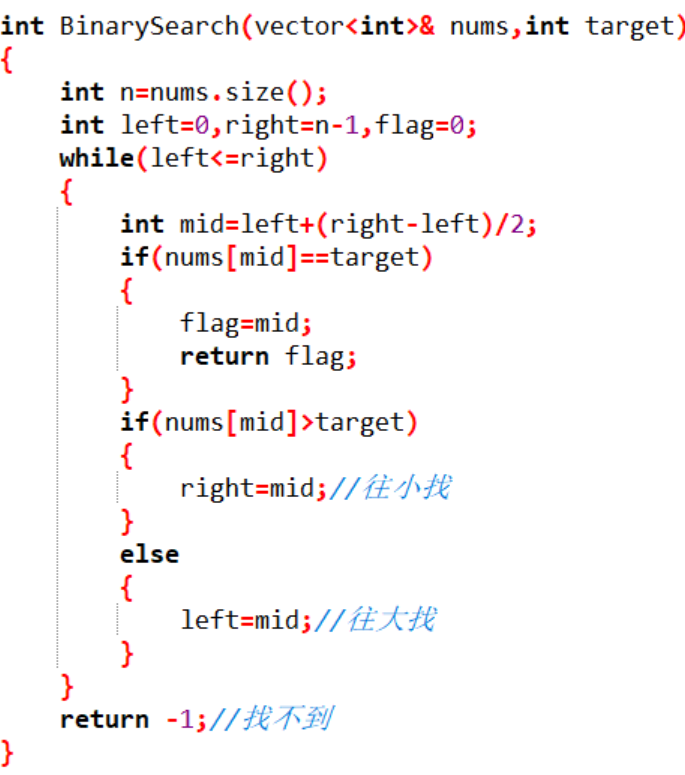<br>
#### 快速排序
1.取一个基准值，将数组拆分为左右两部分，使得基准值左侧都比基准值小，右侧都比基准值大，原理如下：<br>
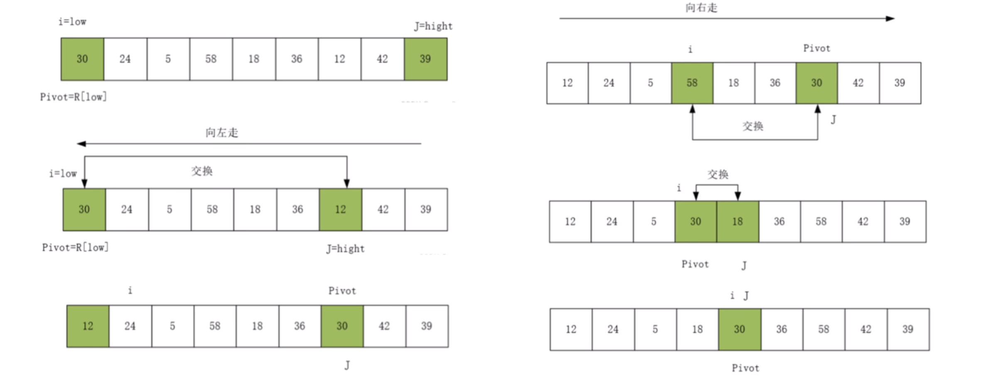<br>
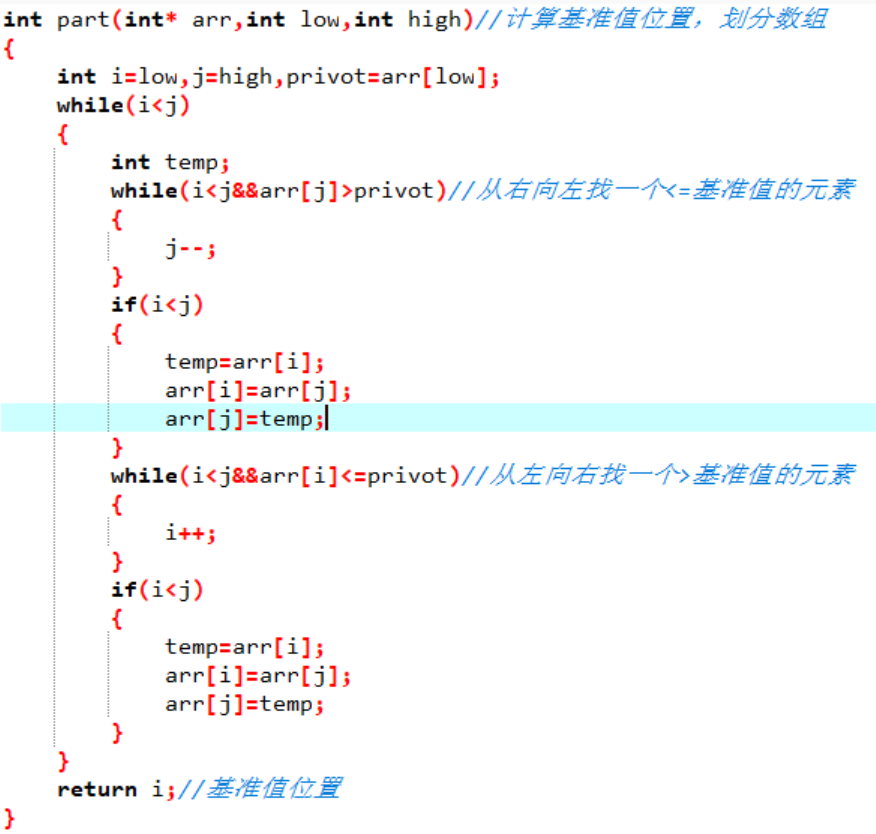<br>
2.对左右两部分数组进行同样的操作(递归)，直至不能再分，数组就整体有序了<br>
(每经过一轮排序，基准元素的位置就会被确定下来)<br>
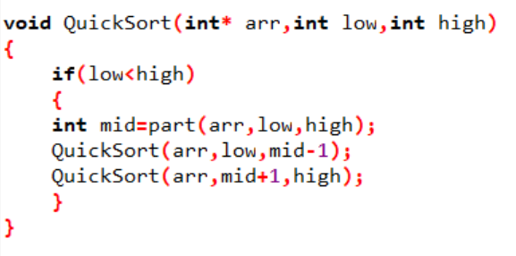
## 五.搜索
### 1.深度优先搜索DFS
从根节点开始，尽可能深的搜索每一个分治，把每一个分支走到尽头后回溯到上一个结点，继续深搜<br>
注：深搜会穷举所有路径，为暴力搜索，时间复杂度较高<br>
代码模板：<br>
```C++
#include<iostream>
using namespace std;

bool check()
{

}
void dfs()
{
	if(满足边界条件)
	{
		return;
	}
	for(int i=0;i<路径数量;i++)
	{
		if(check)
		{
			修改现场;
			dfs();
			还原现场;
		}
	}
}
```
例题1：给定二叉搜索树的根节点root，返回值位于范围[low,high]之间的所有结点的值的和(根节点的值大于左子树，小于右子树)<br>
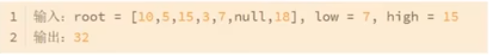<br>
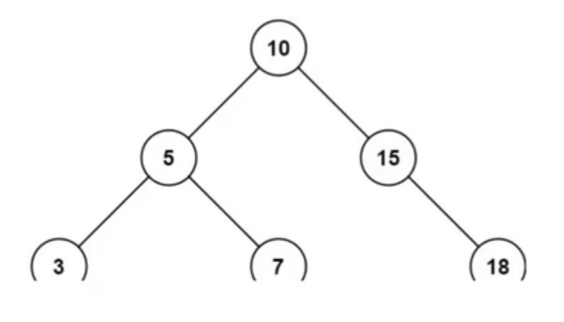<br>
```C++
/*struct TreeNode
{
	int val;
	TreeNode* left;
	TreeNode* right;
};*/

int rangesum(TreeNode* root, int low, int high)
{
	if (root == nullptr)
	{
		return 0;
		//递归边界，死胡同
	}
	if (root->val > high)
	{
		return rangesum(root->left, low, high);
		//如果树值大于high则只需搜索左侧
	}
	if (root->val < low)
	{
		return rangesum(root->right, low, high);
		//如果树值小于low则只需搜索右侧
	}
	return (root->val) + rangesum(root->left, low, high) + rangesum(root->right, low, high);
	//否则返回自己的val并继续搜索左右树
}
```
例题2：<br>
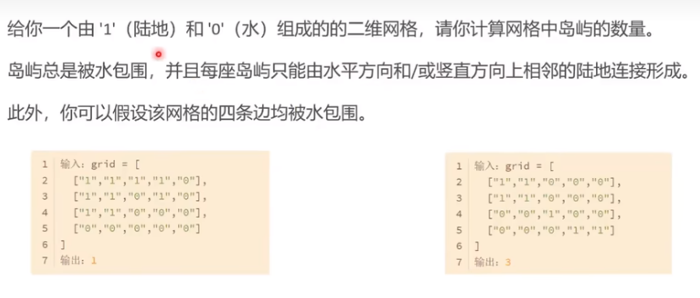<br>
```C++
#include<iostream>
#include<cstdlib>
using namespace std;

void dfs(int** map, int row, int col, int x, int y)
{
	if (x < 0 || x >= row || y < 0 || y >= col || map[x][y] == 0)
	{
		return;//边界条件
	}
	map[x][y] = 0;//标记
	dfs(map, row, col, x + 1, y);
	dfs(map, row, col, x - 1, y);
	dfs(map, row, col, x, y + 1);
	dfs(map, row, col, x, y - 1);//继续搜索边界
}

int islandnum(int** map, int row, int col)
{
	if (map == nullptr || row == 0)
	{
		return 0;
	}
	int count = 0;
	for (int i = 0; i < row; i++)
	{
		for (int j = 0; j < col; j++)
		{
			if (map[i][j] == 1)
			{
				count++;
				dfs(map, row, col, i, j);
				//利用深搜将与此1连接的1全部标记为0
			}
		}
	}
	return count;
}

int main()
{
	cout << "输入r行c列:";
	int r, c;
	cin >> r >> c;
	cout << "输入地图：" << endl;
	int** map = new int* [r+1];
	for (int i = 0; i < r; i++)
	{
		map[i] = new int[c+1];
	}
	for (int i = 0; i < r; i++)
	{
		for (int j = 0; j < c; j++)
		{
			cin >> map[i][j];
		}
	}
	int ans = islandnum(map, r, c); // 计算岛屿数量
	cout << "岛屿数量为：" << ans;
	for (int i = 0; i < r; i++)
	{
		delete[] map[i];
	}
	delete[] map;
	return 0;
}
```
#### 回溯算法（经典N皇后问题）
采用试错的思想，它尝试分步的去解决一个问题。在分步解决问题的过程中，当它通过尝试发现现有的分步答案不能得到有效的正确的解答的时候，它将取消上一步甚至是上几步的计算，再通过其它的可能的分步解答再次尝试寻找问题的答案。<br>

N皇后例题：<br>
思路：<br>
(1)存储方式：二维字符串vetor数组，每一个字符串表示一个解法中的一行，每个一维数组表示一种解法，所有解法存在二维数组中。<br>
(2)标记方式：二维字符数组queen，Q表示皇后.表示空；二维bool数组attack,1表示会被攻击0表示不会<br>
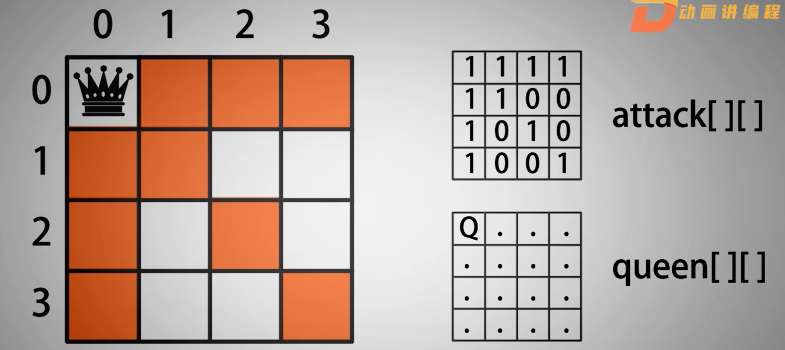<br>
放置Q后，有八个方向需要被标记，构建向量数组，循环时利用这八个向量对attack进行标记<br>
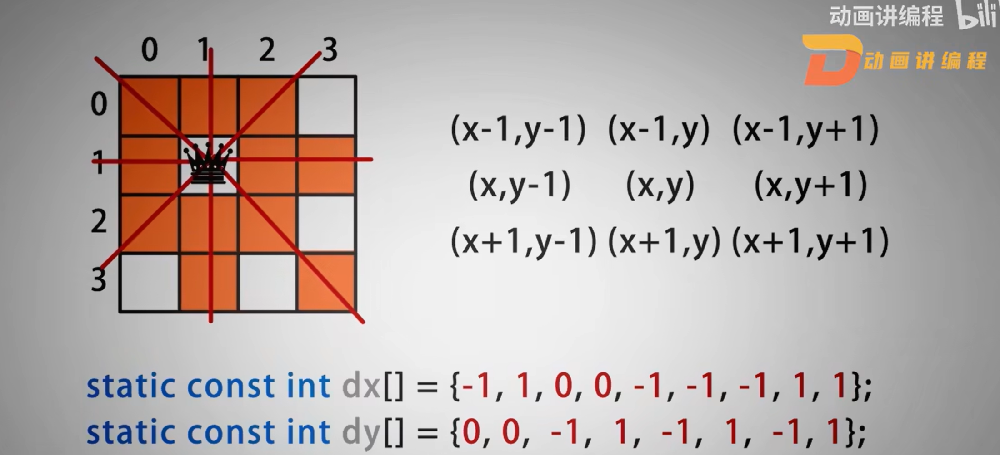<br>
(3)回溯法寻找结果：从第0行开始每行放置Q并标记attack，当某一行无可放位置时说明上一个Q放置不正确，需回溯并重新选择位置。<br>
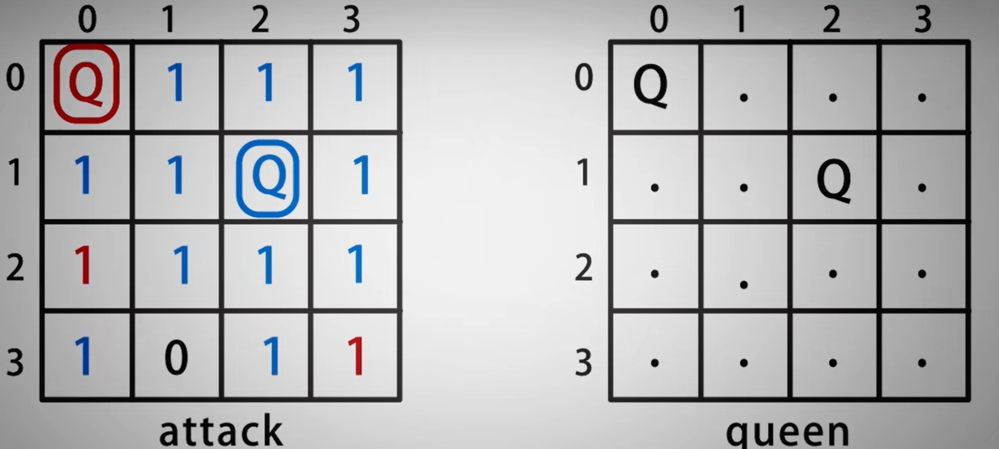<br>
代码示例：
```C++
#include <iostream>
#include<vector>
#include<string>
using namespace std;

const int dx[]={0,1,1,1,0,-1,-1,-1};
const int dy[]={1,1,0,-1,-1,-1,0,1};//方向向量，从正下开始逆时针遍历

void PutQueen(vector<vector<int>>& attack,int x,int y)
{
    attack[y][x]=1;
    for(int i=1;i<attack.size();i++)
    {
        for(int j=0;j<8;j++)//沿8个方向向外扩张
        {
            int x0=x+i*dx[j];
            int y0=y+i*dy[j];
            if(x0<attack.size() && x0>=0 && y0<attack.size() && y0>=0)//在棋盘内
            {
                attack[y0][x0]=1;//标记
            }
        }
    }
}

void Backtrack(int n,int row,vector<string>& queen,vector<vector<int>>& attack,vector<vector<string>>& solve)
{
    //row为当前处理的行
    if(row==n)//此时为合理情况，将此时情况加入解集并返回
    {
        solve.push_back(queen);
        return;
    }
    for(int i=0;i<n;i++)
    {
        if(!attack[row][i])
        {
            vector<vector<int>> temp=attack;//暂存该情况下attack，回溯回来之后用于还原
            queen[row][i]='Q';
            PutQueen(attack,i,row);
            Backtrack(n,row+1,queen,attack,solve);
            attack=temp;
            queen[row][i]='.';//还原
        }
    }
}

vector<vector<string>> SolveNQueens (int n)
{
    vector<vector<string>> solves;
    vector<vector<int>> attack(n);
    vector<string> queen;
    for(int i=0;i<n;i++)
    {
        for(int j=0;j<n;j++)
        {
            attack[i].push_back(0);
        }
        //初始化attack
        queen.push_back("");//加入空字符串
        queen[i].append(n,'.');//初始化该字符串
        //初始化queen
    }
    Backtrack(n,0,queen,attack,solves);//开始从第0行回溯
    return solves;
}

int main()
{
    int n;//n皇后
    cin>>n;
    vector<vector<string>> Solves;
    Solves=SolveNQueens(n);
    cout<<"共"<<Solves.size()<<"种解法："<<endl<<endl;
    for(int i=0;i<Solves.size();i++)
    {
        cout<<"解法"<<i+1<<":"<<endl;
        for(int j=0;j<n;j++)
        {
            cout<<Solves[i][j]<<endl;
        }
    }
    return 0;
}
```
### 2.广度优先搜索BFS
1当碰到岔路口时，总是先一次访问从该岔道口能直接到达的所有结点<br>
2.然后再按这些结点被访问的顺序去依次访问他们能直接到达的结点<br>
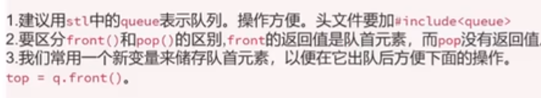
代码模板：
```C++
#include<iostream>
#include<queue>
using namespace std;

void bfs()
{
	queue<int> q;
	q.push(起点S);
	标记初始状态已入队
	while(!q.empty())
	{
		int top=q.front();
		q.pop();//队首出队
		for(所有可列举状态)
		{
			if(check)//数据合法
			{
				q.push(temp);//入队
				//标记为已入队
			}
		}
	}
}
```
例题：
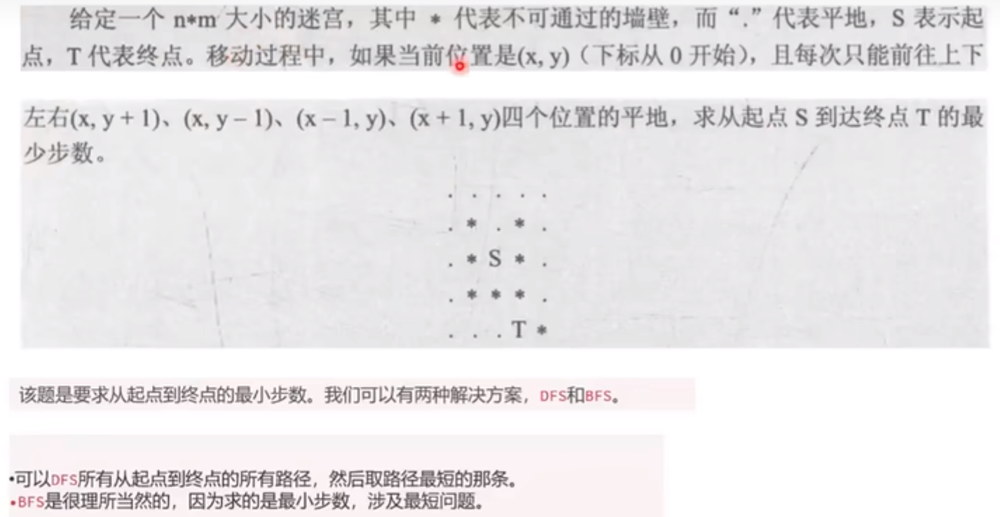
```C++
#include<iostream>
#include<queue>
using namespace std;

char maze[100][100];
bool inq[100][100];//记录入队情况
int r;
int c;
int x[4] = { -1,1,0,0 };
int y[4] = { 0,0,-1,1 };//x[i]y[i]分别为向上下左右

struct node
{
	int x, y;
	int step;
}s,t,node;//起点，终点，临时结点

bool test(int x, int y)
{
	if (x<0 || x>r || y<0 || y>c)//出界
	{
		return false;
	}
	if (maze[x][y] == '*')//墙
	{
		return false;
	}
	if (inq[x][y] == true)//在队里，即走过了
	{
		return false;
	}
	return true;
}

int bfs()
{
	queue<struct node>	q;
	q.push(s);//初始位置入队
	while (!q.empty())
	{
		struct node top = q.front();
		q.pop();//出队
		if (top.x == t.x && top.y == t.y)
		{
			return top.step;//此时为最少步
		}
		for (int i = 0; i < 4; i++)//上下左右
		{
			int newx = top.x + x[i];
			int newy = top.y + y[i];
			if (test(newx, newy))
			//如果下个结点合法就将其入队，继续while
			{
				node.x = newx;
				node.y = newy;
				node.step = top.step + 1;
				q.push(node);
				inq[newx][newy] = true;//标记入队
			}
		}
	}
	return -1;//无解
}

int main()
{
	cout << "输入行和列：";
	cin >> r >> c;
	cout << "输入迷宫：" << endl;
	for (int i = 0; i < r; i++)
	{
		getchar();//吸收换行符
		for (int j = 0; j < c; j++)
		{
			maze[i][j] = getchar();
			if (maze[i][j] == 'S')
			{
				s.x = i;
				s.y = j;
				s.step = 0;
			}
			if (maze[i][j] == 'T')
			{
				t.x = i;
				t.y = j;
				t.step = 0;
			}
		}
	}
	int ans = bfs();
	cout << "最小步数为：" << ans << endl;
	return 0;
}
```
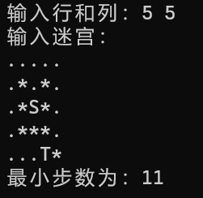
## 六.滑动窗思想（双指针）
该思想的基本思路是维护一个窗口（通常是一个区间），通过移动窗口的起始位置和结束位置，来遍历整个数组/字符串，并在过程中执行特定的操作。通过不断调整窗口的大小和位置，可以找到满足问题要求的解。<br>
例题：<br>
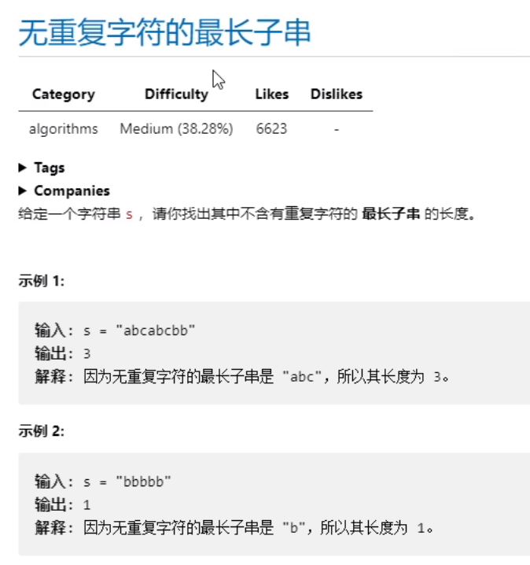<br>
思路图例：<br>
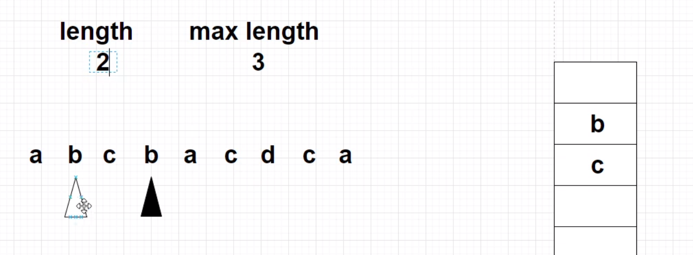<br>

```C++
#include <iostream>
#include<set>
using namespace std;

int main() {
    string str;
    cin>>str;//输入待测字符串
    int left=0;
    int right=0;//窗口首尾位置
    int l=str.length();
    set<char> s;//存储字串中含有的元素
    int sublen=0;
    int max=0;
    while(right<l)
    {
        auto it=s.find(str[right]);
        if(it == s.end())//字串中无当前字符
        {
            s.insert(str[right]);
            right++;
        }
        else
        {
            s.erase(str[left]);
            left++;
        }
        sublen=right-left;
        if(sublen>max)
        {
            max=sublen;
        }
    }
    cout<<max<<endl;
    return 0;
}
```
